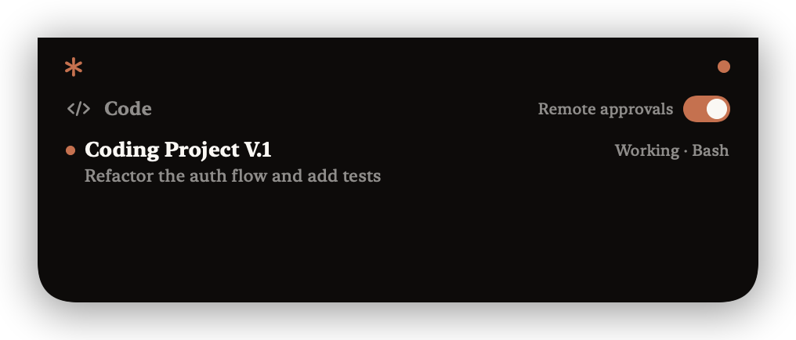

# Claude Widget

Open-source status widgets for [Claude Code](https://claude.com/claude-code). See what Claude is working on and approve permission requests without staring at the terminal — from a **dynamic island on your Mac's notch** (flagship) or an experimental **iOS home-screen widget**.

<p align="center">
  
</p>
<p align="center">
  
  &nbsp;
  
</p>
<p align="center"><sub>Rendered from the real SwiftUI views — regenerate anytime with <code>macos/build.sh --readme-assets</code>.</sub></p>

## ✳ Claude Island (macOS) — start here

A tiny native app that lives around your MacBook's notch, like a dynamic island:

- **Collapsed**: a slim black extension of the notch with a status dot — terracotta pulse while Claude works, orange when something needs you, green when idle.
- **Auto-expands** when Claude requests permission, showing **Always allow / Allow once / Deny** right under the notch. *Always allow* saves a rule (e.g. `Bash:npm`) that auto-approves matching requests from then on.
- **Hover** over the notch anytime to peek at active sessions and their last prompt, and to toggle remote approvals.
- Non-activating panel: clicking buttons never steals focus from what you're doing. Menu-bar ✳ icon as fallback for Macs without a notch.

```bash
./install.sh                    # once: creates ~/.claude-widget (token + hooks)
node server/server.js &         # the relay; keep it running
cd macos && ./build.sh --run    # build + launch the island (needs only Command Line Tools)
```

Then merge [hooks/settings.example.json](hooks/settings.example.json) into `~/.claude/settings.json` and restart Claude Code. That's the whole setup — the island reads its config from `~/.claude-widget/config.json` automatically.

> `build.sh` compiles with plain `swiftc` (no Xcode.app needed) and auto-works-around a common broken-CLT issue (stale duplicate `SwiftBridging` modulemap). A SwiftPM [Package.swift](macos/Package.swift) is also included if you prefer `swift build`.

## Features

- **Live session status** — the widget shows your active Claude Code sessions, what they're working on, and whether they need attention.
- **Remote permission approvals** — when Claude wants to run a command, edit a file, or fetch a URL, the request appears on the widget with **Always allow / Allow once / Don't allow** buttons (interactive widgets, iOS 17+). *Always allow* saves a rule (e.g. `Bash:npm`) so matching requests auto-approve next time.
- **Quick Ask** — send a one-shot prompt from your phone; your Mac runs `claude -p` headlessly and returns the answer.
- **Fails open, fails safe** — if the relay is down or you don't answer in time, Claude Code falls back to its normal terminal prompt. Nothing is auto-approved without you.

## How it works

```
┌───────────────── Mac ─────────────────┐      ┌──── iPhone (experimental) ───┐
│                                       │      │                              │
│  Claude Code                          │      │  App + WidgetKit extension   │
│   │  hooks (PreToolUse,               │ HTTP │   │  polls /status           │
│   │  Stop, Notification, …)           │◄────►│   │  POST /respond           │
│   ▼                                   │ LAN/ │   ▼                          │
│  relay server (Node, :8787)           │ Tailscale  interactive buttons      │
│   ▲                                   │      └──────────────────────────────┘
│   │ localhost                         │
│  ✳ Claude Island (notch app, macos/)  │
└───────────────────────────────────────┘
```

1. **Hooks** ([hooks/](hooks/)) — a `PreToolUse` hook forwards each permission-relevant tool call to the relay and *waits*; status hooks (`UserPromptSubmit`, `PostToolUse`, `Stop`, `Notification`, `SessionEnd`) report what the session is doing.
2. **Relay** ([server/server.js](server/server.js)) — a zero-dependency Node server that holds session state and pending requests. A client answers `always | once | deny`; the hook returns Claude Code's `permissionDecision` accordingly.
3. **Claude Island** ([macos/](macos/)) — native AppKit/SwiftUI notch panel polling the relay on localhost every 1.5 s, so requests appear near-instantly.
4. **iOS** ([ios/](ios/)) — SwiftUI app + WidgetKit extension. Widget buttons are App Intents that hit `/respond` directly. Experimental: it works, but home-screen widget refresh is throttled by iOS and building it requires an Apple developer setup — which is why the Mac island is the recommended client.

## iOS setup (experimental)

### Requirements

- macOS with Claude Code and Node.js 18+
- iOS 17+, Xcode 15+, [XcodeGen](https://github.com/yonaskolb/XcodeGen) (`brew install xcodegen`)
- Phone and Mac on the same network (or connected via [Tailscale](https://tailscale.com) — recommended for use away from home)

### 1. Mac side

```bash
./install.sh                  # creates ~/.claude-widget (token + hook scripts)
node server/server.js         # start the relay; keep it running
```

Then merge the hooks from [hooks/settings.example.json](hooks/settings.example.json) into `~/.claude/settings.json` and restart Claude Code. To route approvals only for specific projects, put the hooks in that project's `.claude/settings.json` instead.

### 2. iOS side

```bash
cd ios
# Edit project.yml: set your bundleIdPrefix + team, and pick an App Group id.
# Update the same App Group id in Shared/Models.swift (AppGroup.identifier).
xcodegen generate
open ClaudeWidget.xcodeproj
```

In Xcode: select your signing team for both targets, enable the App Group capability on both (Xcode creates it on your developer account), then build to your phone.

Open the app → **Settings** → enter the server URL and token that `install.sh` printed → **Test connection** → Save. Add the widget to your home screen.

### 3. Try it

Start a Claude Code session, toggle **Remote approvals** on (in the app or widget), and ask Claude to run a command. The request appears on your widget — tap **Allow once**.

## Security notes

- Every endpoint requires the bearer token created by `install.sh`. Treat it like a password.
- Traffic is plain HTTP. Fine on a trusted LAN; for anything else, use **Tailscale** (encrypts end-to-end) rather than port-forwarding the relay to the internet. Never expose port 8787 publicly.
- The permission gate **fails open to the terminal** — a dead relay never silently approves anything.
- "Always allow" rules live in `~/.claude-widget/rules.json` on your Mac; clear them from the app or by deleting the file.

## Limitations (v1)

- The permission gate waits up to 2 minutes (configurable via `gateTimeoutMs`) for a click, then falls back to the terminal prompt. A dead relay never silently approves anything.
- **iOS only:** home-screen widget refresh is throttled by iOS, so a pending request can take minutes to appear there (the Mac island polls localhost every 1.5 s and is near-instant; the iOS in-app view polls every 3 s).
- Quick Ask starts a fresh headless `claude -p` run — it doesn't inject into a live session.
- The relay keeps session state in memory (restarting it clears history); on iOS the token lives in shared UserDefaults, not the Keychain.

## Roadmap

- [ ] Island: launch-at-login helper + Homebrew tap
- [ ] Island: click a session to peek at its transcript ("View Session")
- [ ] Island: Quick Ask input right in the notch
- [ ] iOS: Live Activities + push (APNs or [ntfy](https://ntfy.sh)) for instant updates
- [ ] Quick Ask targeting a running session
- [ ] Apple Watch complication

## Contributing

PRs welcome. The relay and hooks have no dependencies on purpose — keep it that way if you can. For iOS changes, please test on-device (interactive widgets don't fully work in the simulator).

## License

[MIT](LICENSE)
